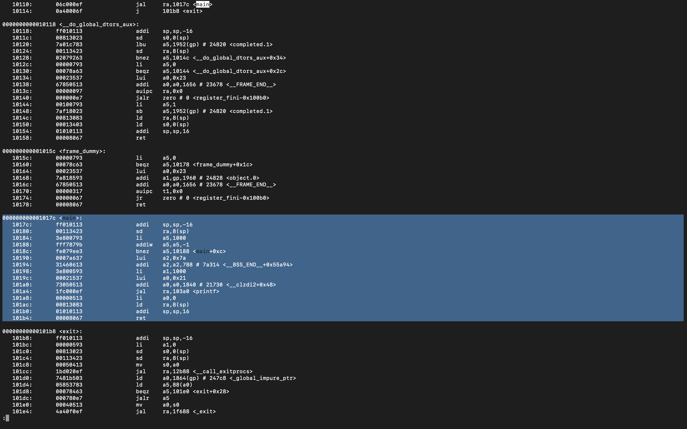
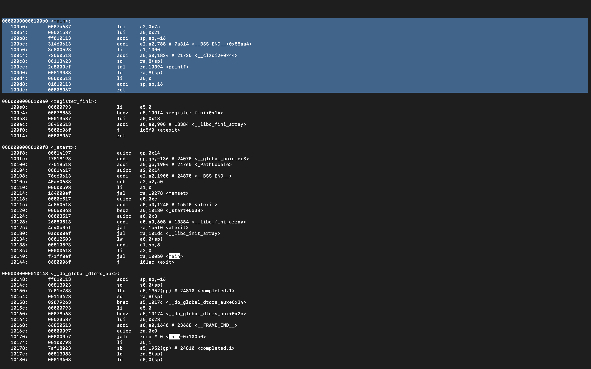
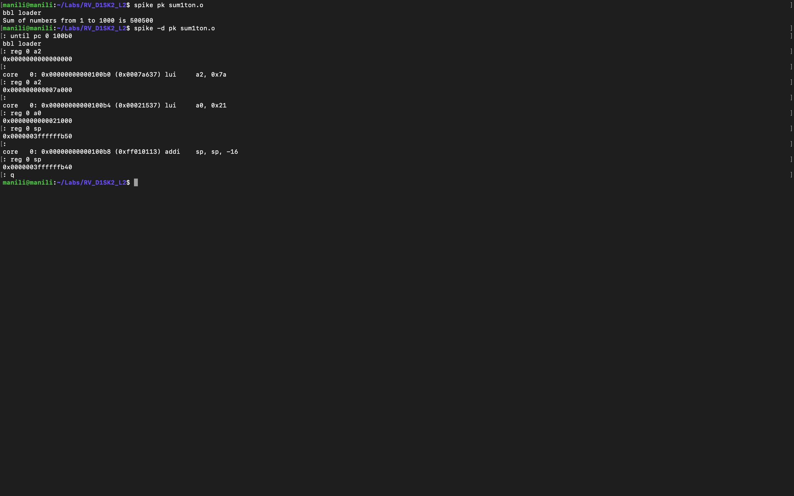
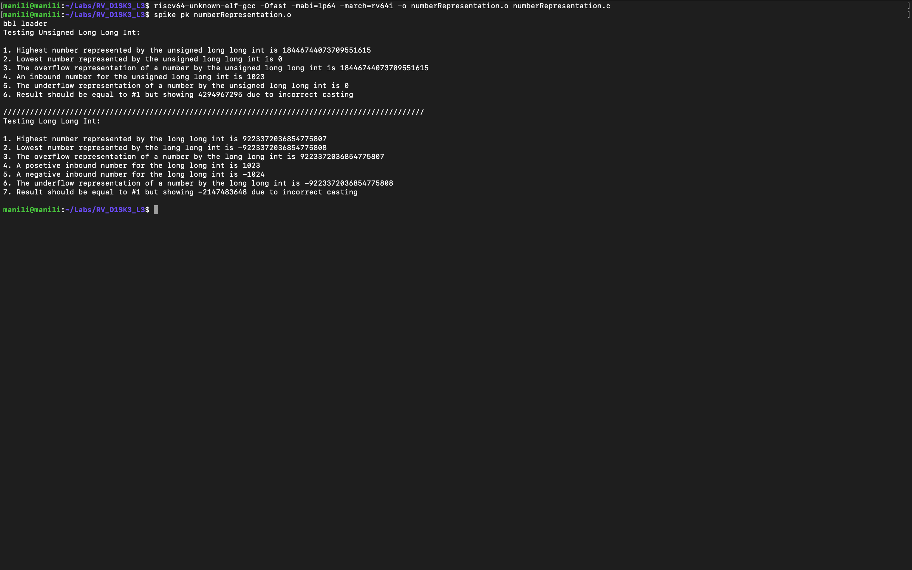
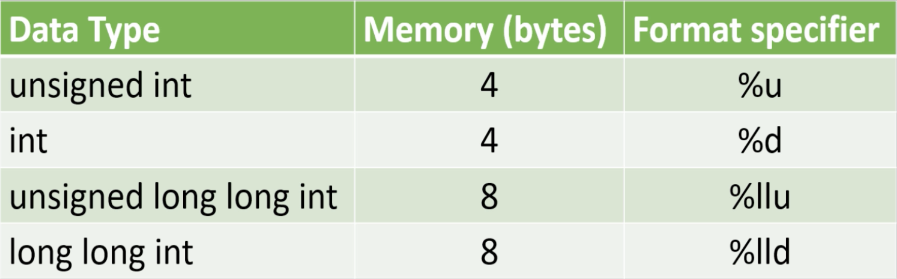
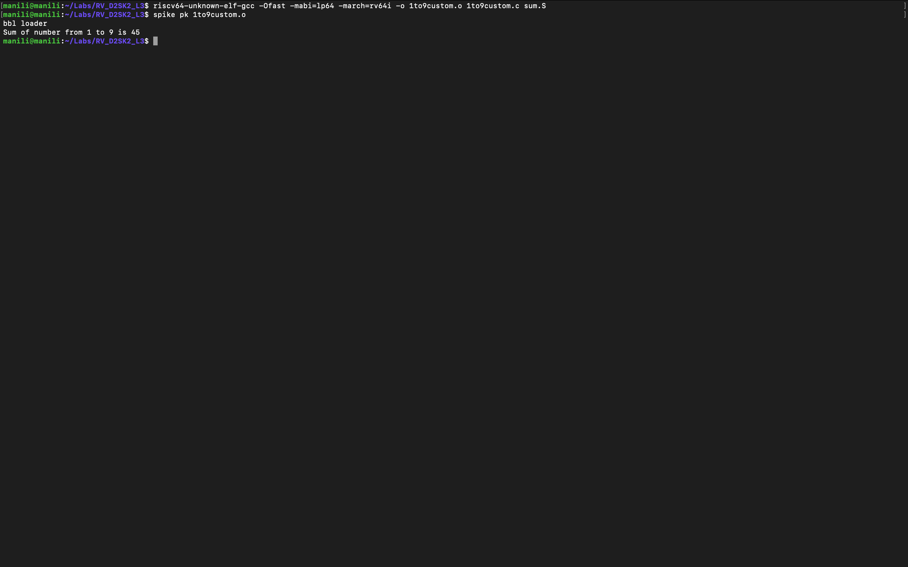
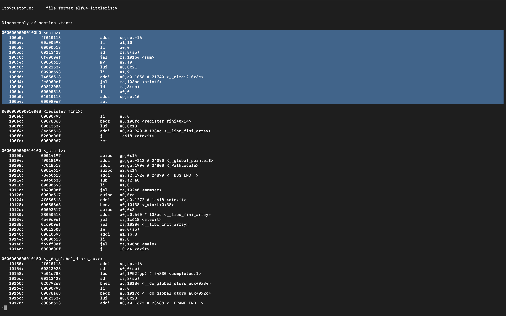
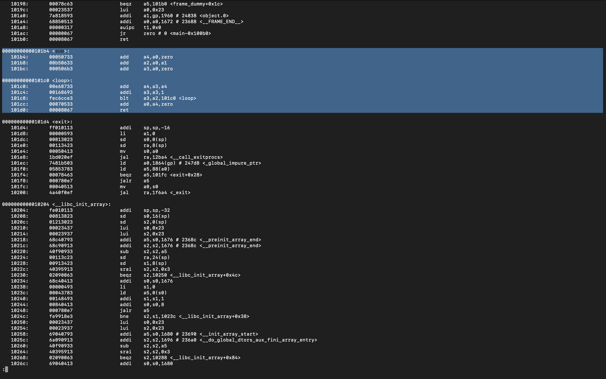
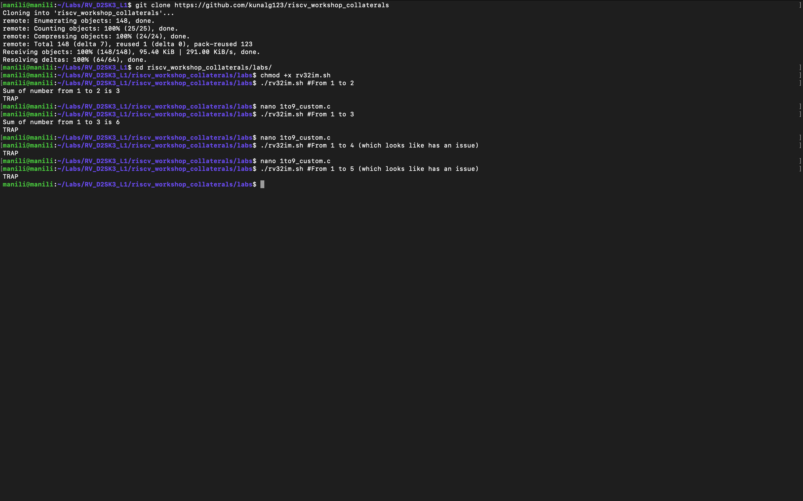

# MYTH-workshop
A 5-day workshop to implement a RISC-V based processor named MYTH from both SW and HW aspects.

# Table of Contents
- [Tools needed for the workshop](#tools-needed-for-the-workshop)
  - [Overview of GNU compiler toolchain](#overview-of-gnu-compiler-toolchain)
    - [Install toolchain from the source code](#install-toolchain-from-the-source-code)
  - [Overview of Spike simulator](#overview-of-spike-simulator)
    - [Install Spike from the source code](#install-spike-from-the-source-code)
  - [Overview of iVerilog simulator](#overview-of-iverilog-simulator)
    - [Install iVerilog from package manager](#install-iverilog-from-package-manager)
- [Introduction to RISC-V ISA](#introduction-to-risc-v-isa)
  - [Hands-on lab 1](#hands-on-lab-1)
    - [RISCV GCC compile](#riscv-gcc-compile)
    - [RISCV GCC disassemble](#riscv-gcc-disassemble)
    - [Spike simulation and debug](#spike-simulation-and-debug)
- [Introduction to integer number representation](#introduction-to-integer-number-representation)
  - [Signed and unsigned numbers](#signed-and-unsigned-numbers)
  - [Hands-on lab 2](#hands-on-lab-2)
- [Introduction to ABI](#introduction-to-abi)
  - [Hands-on lab 3](#hands-on-lab-3)
    - [Summation of 1 to N using ASM on Spike](#summation-of-1-to-n-using-asm-on-spike)
    - [Summation of 1 to N using ASM on PicoRV32](#summation-of-1-to-n-using-asm-on-picorv32)
- [Digital logic with TL-Verilog and Makerchip](#digital-logic-with-tl-verilog-and-makerchip)
  - [What is TL-Verilog](#what-is-tl-verilog)
  - [What is Makerchip](#what-is-makerchip)
  - [Hands-on lab 4](#hands-on-lab-4)

# Tools needed for the workshop

There are some tools needed to be installed on your local computer for hands-on labs. Those include:
1. The GNU compiler toolchain
2. The Spike simulator
3. The iVerilog simulator

## Overview of GNU compiler toolchain

The GNU Toolchain is a set of programming tools in Linux systems that programmers can use to make and compile their code to produce a program or library. So, how the machine code which is understandable by processer is explained below.

  * Preprocessor - Process source code before compilation. Macro definition, file inclusion or any other directive if present then are preprocessed. 
  * Compiler - Takes the input provided by preprocessor and converts to assembly code.
  * Assembler - Takes the input provided by compiler and converts to relocatable machine code.
  * Linker - Takes the input provided by Assembler and converts to Absolute machine code.

### Install toolchain from the source code

Here are the steps to install the toolchain from the source code:

  ```
  $ cd
  $ git clone https://github.com/riscv/riscv-gnu-toolchain
  $ cd riscv-gnu-toolchain
  $ sudo apt-get install autoconf automake autotools-dev curl python3 libmpc-dev libmpfr-dev libgmp-dev gawk build-essential bison flex texinfo gperf libtool patchutils bc zlib1g-dev libexpat-dev
  $ ./configure --prefix=/opt/riscv --with-arch=rv32gc --with-abi=ilp32d --with-arch=rv64gc --with-abi=ilp64d --with-arch=rv64i --with-abi=lp64 --prefix=/opt/riscv --enable-multilib
  $ sudo make -jN #Where N is the number of your cores e.g. 4
  $ export RISCV=/opt/riscv/
  $ export PATH=$PATH:$RISCV/bin
  ```

## Overview of Spike simulator

Spike is the golden reference functional RISC-V ISA C++ sofware simulator. It provides full system emulation or proxied emulation with HTIF/FESVR. It serves as a starting point for running software on a RISC-V target. Here is a highlight of some of Spikes main features:

  1. Multiple ISAs: RV32IMAFDQCV extensions
  2. Multiple memory models: Weak Memory Ordering (WMO) and Total Store Ordering (TSO)
  3. Privileged Spec: Machine, Supervisor, User modes (v1.11)
  4. Debug Spec
  5. Single-step debugging with support for viewing memory/register contents
  6. Multiple CPU support
  7. JTAG support
  8. Highly extensible (add and test new instructions)

[Reference](https://chipyard.readthedocs.io/en/latest/Software/Spike.html)

### Install Spike from the source code

Here are the steps to install the Spike from the source code:

  ```
  $ cd
  $ git clone https://github.com/riscv/riscv-isa-sim
  $ cd riscv-isa-sim
  $ sudo apt-get install device-tree-compiler
  $ mkdir build
  $ cd build
  $ ../configure --prefix=$RISCV
  $ sudo make -jN #Where N is the number of your cores e.g. 4
  $ sudo make install
  ```

## Overview of iVerilog simulator

Icarus Verilog (iVerilog) is a Verilog simulation and synthesis tool. It operates as a compiler, compiling source code written in Verilog (IEEE-1364) into some target format. For batch simulation, the compiler can generate an intermediate form called vvp assembly. This intermediate form is executed by the `vvp` command. For synthesis, the compiler generates netlists in the desired format.

### Install iVerilog from package manager

Here is the step to install the iVerilog from the APT package manager:

  ```
  $ sudo apt install iverilog
  ```

# Introduction to RISC-V ISA

A RISC-V ISA is defined as a base integer ISA, which must be present in any implementation, plus optional extensions to the base ISA. Each base integer instruction set is characterized by
  1. Width of the integer registers (XLEN) 
  2. Corresponding size of the address space
  3. Number of integer registers (32 in RISC-V)

More details on RISC-V ISA can be obtained [here](https://github.com/riscv/riscv-isa-manual/releases/download/draft-20200727-8088ba4/riscv-spec.pdf).

## Hands-on lab 1

In this lab the following snippet of code will be used for compilation and debug. Here is the code snippet:

  ```
  #include <stdio.h>
  
  int main() {
    int i, sum = 0, n = 5;
    
    for(i = 1; i <= n; i++) {
        sum += i;
    }

    printf("Sum of numbers from 1 to %d is %d\n", n, sum);

    return 0;
  }
  ```

The code snippet will be stored in a file named `sum1ton.c`. This file will be used during this hands-on lab.

### RISCV GCC compile

To compile the source code following template command will be used:

  ```
  $ riscv64-unknown-elf-gcc -O[COMPILER OPTIONS] -mabi=[ABI SPECIFIER] -march=[TARGET ARCHITECTURE] -o [OUTOUT FILE] [INPUT FILES]
  ```
  
[Here](https://www.sifive.com/blog/all-aboard-part-1-compiler-args) is the reference for the compiler options. So in this case here are two sample commands to compile the code:
  
  ```
  $ riscv64-unknown-elf-gcc -O1 -mabi=lp64 -march=rv64i -o sum1ton.o sum1ton.c
  $ riscv64-unknown-elf-gcc -Ofast -mabi=lp64 -march=rv64i -o sum1ton.o sum1ton.c
  ```

### RISCV GCC disassemble

After compiling the source code it's time for disassembling and see what happend inside. The following command demonstrates how to disassemble the code:

  ```
  riscv64-unknown-elf-objdump -d [INPUT NAME] | less #Use less command to see the result page by page and search in the text by pressing / key
  ```

So in this case here is the proper command to disassemble:

  ```
  riscv64-unknown-elf-objdump -d sum1ton.o | less
  ```

Following picture shows the result of compiling the code with `-O1`:

  

And here is the result of compilation with `-Ofast` option:

  

Now our main question about the difference of `-O1` and `-Ofast` options could be answered. It is observed that using `-Ofast` option may reduce the number of instructions from 15 to 12 campared to `-O1`. [This](https://gcc.gnu.org/onlinedocs/gcc/Optimize-Options.html) is a compelete reference for the GCC compiler optimization options.

### Spike simulation and debug

It is possible to use Spike for both simulation and debugging. Following command will run the RISC-V application on x86_64 architecture host machine and provide the result to the end user:

  ```
  spike pk [APPLICATION NAME]
  ```

It is also possible to use Spike for debugging purposes by following command:

  ```
  spike -d pk [APPLICATION NAME]
  ```

There are some very important commands for debugging:

  ```
  until pc 0 [MEMORY ADDRESS] //Sets a breakpoint on [MEMORY ADDRESS]
  Enter Key //Steps during debugging process
  reg 0 [REGISTER IDENTIFICATION] //Show contents of specified register in [REGISTER IDENTIFICATION]
  q //Exit debugging 
  ```
  
Following picture shows an example of using Spike, both in simulation and debugging modes:

  

# Introduction to integer number representation

Computers understand zeros and ones but human usually decimal numbers. In other words there should be existed a way to convert decimal numbers to binary and vice versa. Agorithms like [these](https://www.electronics-tutorials.ws/binary/bin_2.html) will do the job for us.

## Signed and unsigned numbers

A number in CPU may represent as signed or unsigned number. [Here](https://en.wikipedia.org/wiki/Signed_number_representations) is a very compelete reference for the signed and unsigned number presentation. Also [this](https://en.wikipedia.org/wiki/Signedness) is another good source for signedness

## Hands-on lab 2

In this lab the following snippet of code will be used for compilation and debug. Here is the code snippet:

  ```
  #include <stdio.h>
  #include <math.h>
  
  int main() {
    //////////////////////////////////////// unsigned long long int tests: ///////////////////////////////////////
    printf("Testing Unsigned Long Long Int:\n\n");
    
    unsigned long long int max_ulli = (unsigned long long int) (pow(2, 64) - 1);
    printf("1. Highest number represented by the unsigned long long int is %llu\n", max_ulli);
    
    unsigned long long int min_ulli = (unsigned long long int) (pow(2, 0) - 1);
    printf("2. Lowest number represented by the unsigned long long int is %llu\n", min_ulli);
    
    unsigned long long int overflow_ulli = (unsigned long long int) (pow(2, 65) - 1);
    printf("3. The overflow representation of a number by the unsigned long long int is %llu\n", overflow_ulli);
    
    unsigned long long int inbound_ulli = (unsigned long long int) (pow(2, 10) - 1);
    printf("4. An inbound number for the unsigned long long int is %llu\n", inbound_ulli);
    
    unsigned long long int underflow_ulli = (unsigned long long int) (pow(2, 10) * -1);
    printf("5. The underflow representation of a number by the unsigned long long int is %llu\n", underflow_ulli);
    
    unsigned long long int incorrect_cast_ulli = (unsigned int) (pow(2, 64) - 1);
    printf("6. Result should be equal to #1 but showing %llu due to incorrect casting\n", incorrect_cast_ulli);
    
    //////////////////////////////////////////////////////////////////////////////////////////////////////////////
    printf("\n///////////////////////////////////////////////////////////////////////////////////////////////\n");
    //////////////////////////////////////////// long long int tests: ////////////////////////////////////////////
    printf("Testing Long Long Int:\n\n");
    
    long long int max_lli = (long long int) (pow(2, 63) - 1);
    printf("1. Highest number represented by the long long int is %lld\n", max_lli);
    
    long long int min_lli = (long long int) (pow(2, 63) * -1);
    printf("2. Lowest number represented by the long long int is %lld\n", min_lli);
    
    long long int overflow_lli = (long long int) (pow(2, 64) - 1);
    printf("3. The overflow representation of a number by the long long int is %lld\n", overflow_lli);
    
    long long int inbound1_lli = (long long int) (pow(2, 10) - 1);
    printf("4. A posetive inbound number for the long long int is %lld\n", inbound1_lli);
    
    long long int inbound2_lli = (long long int) (pow(2, 10) * -1);
    printf("5. A negative inbound number for the long long int is %lld\n", inbound2_lli);
    
    long long int underflow_lli = (long long int) (pow(2, 64) * -1);
    printf("6. The underflow representation of a number by the long long int is %lld\n", underflow_lli);
    
    long long int incorrect_cast_lli = (int) (pow(2, 63) * -1);
    printf("7. Result should be equal to #1 but showing %lld due to incorrect casting\n", incorrect_cast_lli);
    
    //////////////////////////////////////////////////////////////////////////////////////////////////////////////
    printf("\n");
    
    return 0;
  }
  ```

The code snippet will be stored in a file named `numberRepresentation.c`. This file will be used during this hands-on lab.
When `numberRepresentation.c` has been compiled (just like how we did on [RISCV GCC compile](#riscv-gcc-compile) section), it's time to execute it by Spike simulator (just like how we did on [Spike simulation and debug](#spike-simulation-and-debug) section). The result will be something like:

  

During the lab there was an important question about reason of inequality between calculated maximum/minimum of 64-bit signed integer and the result of the program. As it may be seen in the program, the problem occures due to wrong type casting. So to find a proper data type, here is the table for using Integer on C programming language:

  

# Introduction to ABI

An Application Binary Interface is a set of rules enforced by the Operating System on a specific architecture. So, Linker converts relocatable machine code to absolute machine code via ABI interface specific to the architecture of machine.

So, it is system call interface used by the application program to access the registers specific to architecture. Overhere the architecture is RISC-V, so to access 32 registers of RISC-V below is the table which shows the calling convention (ABI name) given to registers for the application programmer to use.
[(Image source)](https://riscv.org/wp-content/uploads/2015/01/riscv-calling.pdf)


## Hands-on lab 3

In this lab ABI will be studied with two diffrent ways. First, Spike will be used to simulate the program like before. Second, as a new way of simulation, an RTL level RISC-V core named PiceRV32 will run the code and return the result. The results of two diffrent methods must be the same, which provides a way of verification for Spike and PicoRV32 functionality. The following are the two snippet codes will be used in the lab. 

Here is the `1to9custom.c` file:

  ```
  #include <stdio.h>
  
  extern int sum(int x, int y);
  
  int main() {
    int result = 0;
    int N = 9;
    result = sum(0x0, N + 1);
    printf("Sum of number from 1 to %d is %d\n", count, result);
  }
  ```

Here is the `sum.S` file (WARNING: you must use *.S not *.s otherwise the assembler will be complained):

  ```
  .section .text
  .global sum
  .type sum, @function
  
  sum:
    add 	a4, a0, zero //Initialize sum register a4 with 0x0
    add 	a2, a0, a1   // store count of 10 in register a2. Register a1 is loaded with 0xa (decimal 10) from main program
    add	a3, a0, zero // initialize intermediate sum register a3 by 0
  loop:	add 	a4, a3, a4   // Incremental addition
    addi 	a3, a3, 1    // Increment intermediate register by 1
    blt 	a3, a2, loop // If a3 is less than a2, branch to label named <loop>
    add	a0, a4, zero // Store final result to register a0 so that it can be read by main program
    ret
  ```

### Summation of 1 to N using ASM on Spike

In this lab user will use a function written in assembly language to calculate the summation of 1 to N. The `N` variable will be sent by the C program as an argument of the `sum` function. Here is how to compile and simulate the program:

  ```
  riscv64-unknown-elf-gcc -O1 -mabi=lp64 -march=rv64i -o 1to9custom.o 1to9custom.c sum.S
  spike pk 1to9custom.o
  ```
And here is the result:

  

It's time to disassemble the program and see what's happened inside by the following command:

  ```
  riscv64-unknown-elf-objdump -d 1to9custom.o
  ```
And these are the main and sum functions:

  
  
  

### Summation of 1 to N using ASM on PicoRV32

For the first time in this workshop, participants are going to test a program on a real tiny RISC-V core using iVerilog. PicoRV32 is a small RISC-V core developed by Clifford Wolf in verilog language. It is pissible to use iVerilog for PicoRV32 functional level simulation. Here are the commands to do so:

  ```
  cd
  git clone https://github.com/kunalg123/riscv_workshop_collaterals
  cd riscv_workshop_collaterals/labs/
  chmod +x rv32im.sh
  ./rv32im.sh
  ```
These commands will download the source code, compile them and launch the simulation process. The following shows the result of executing these commands:

  
  
As it could be seen on the image, the process does not support `N` more than 3.

# Digital logic with TL-Verilog and Makerchip

In this day TL-Verilog and the Makerchip IDE will be used to learn basic concepts of the digital design and creating a simple caculator logic. These basic concepts will be used during day four and five to create the RISC-V core.

## What is TL-Verilog

Transaction-Level Verilog (TL-Verilog) is an emerging extension to SystemVerilog that supports a new design methodology, called transaction-level design. A transaction, in this methodology, is an entity that moves through structures like pipelines, arbiters, and queues, A transaction might be a machine instruction, a flit of a packet, or a memory read/write. Transaction logic, like packet header decode or instruction execution, that operates on the transaction can be placed anywhere along the transaction's flow. Tools produce the logic to carry signals through their flows to stitch the transaction logic. [Reference](https://arxiv.org/abs/1811.01780)

## What is Makerchip

Makerchip provides free and instant access to the latest tools both from a web browser and desktop computer. This includes open-source tools and proprietary ones. [Reference](http://makerchip.com)

  

## Hands-on lab 4

