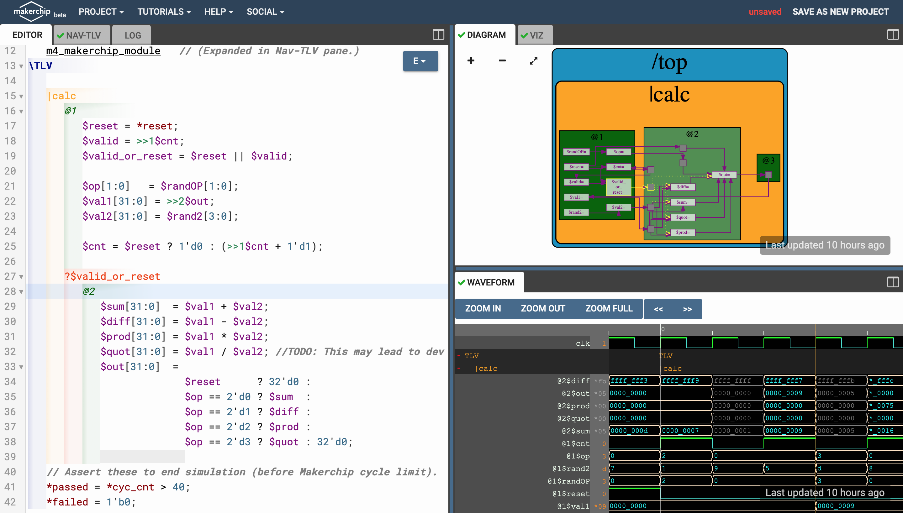
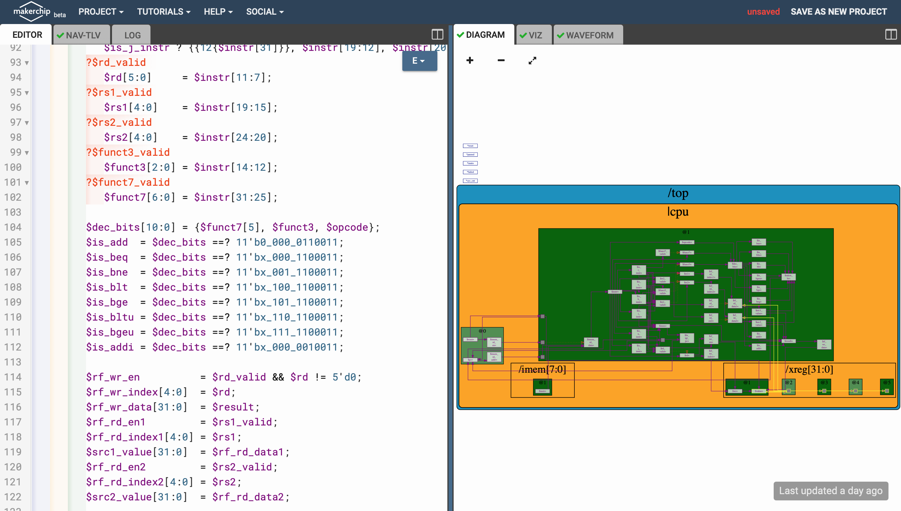

# MYTH-workshop
A 5-day workshop to implement a RISC-V based processor named MYTH from both SW and HW aspects.

# Table of Contents
- [Tools needed for the workshop](#tools-needed-for-the-workshop)
  - [Overview of GNU compiler toolchain](#overview-of-gnu-compiler-toolchain)
    - [Install toolchain from the source code](#install-toolchain-from-the-source-code)
  - [Overview of Spike simulator](#overview-of-spike-simulator)
    - [Install Spike from the source code](#install-spike-from-the-source-code)
  - [Overview of iVerilog simulator](#overview-of-iverilog-simulator)
    - [Install iVerilog from package manager](#install-iverilog-from-package-manager)
- [Introduction to RISC-V ISA](#introduction-to-risc-v-isa)
  - [Hands-on lab 1](#hands-on-lab-1)
    - [RISCV GCC compile](#riscv-gcc-compile)
    - [RISCV GCC disassemble](#riscv-gcc-disassemble)
    - [Spike simulation and debug](#spike-simulation-and-debug)
- [Introduction to integer number representation](#introduction-to-integer-number-representation)
  - [Signed and unsigned numbers](#signed-and-unsigned-numbers)
  - [Hands-on lab 2](#hands-on-lab-2)
- [Introduction to ABI](#introduction-to-abi)
  - [Hands-on lab 3](#hands-on-lab-3)
    - [Summation of 1 to N using ASM on Spike](#summation-of-1-to-n-using-asm-on-spike)
    - [Summation of 1 to N using ASM on PicoRV32](#summation-of-1-to-n-using-asm-on-picorv32)
- [Digital logic with TL-Verilog and Makerchip](#digital-logic-with-tl-verilog-and-makerchip)
  - [What is TL-Verilog](#what-is-tl-verilog)
  - [What is Makerchip](#what-is-makerchip)
  - [Hands-on lab 4](#hands-on-lab-4)
    - [Combinational logics](#combinational-logics)
    - [Sequential logics](#sequential-logics)
    - [Pipelined logics](#pipelined-logics)
    - [Validity](#validity)
    - [Lab 4 final result](#lab-4-final-result)
- [RISCV-based CPU named MYTH](#riscv-based-cpu-named-myth)
  - [Introduction to MYTH micro-architecture](#introduction-to-myth-micro-architecture)
    - [Fetch](#fetch)
    - [Decode](#decode)
    - [Read register file](#read-register-file)
    - [Execute](#execute)
    - [Write register file](#write-register-file)
  - [Hands-on lab 5](#hands-on-lab-5)
- [Pipelining MYTH processor](#pipelining-myth-processor)
  - [Introduction to MYTH pipelining](#introduction-to-myth-pipelining)
  - [Pipelining hazards](#pipelining-hazards)
    - [Structural hazard](#structural-hazard)
    - [Control hazard](#control-hazard)
    - [Data hazard](#data-hazard)
  - [Hands-on lab 6](#hands-on-lab-6)
- [Wrap up](#wrap-up)
- [Acknowledgements](#acknowledgements)

# Tools needed for the workshop

There are some tools needed to be installed on your local computer for hands-on labs. Those include:
1. The GNU compiler toolchain
2. The Spike simulator
3. The iVerilog simulator

## Overview of GNU compiler toolchain

The GNU Toolchain is a set of programming tools in Linux systems that programmers can use to make and compile their code to produce a program or library. So, how the machine code which is understandable by processer is explained below.

  * Preprocessor - Process source code before compilation. Macro definition, file inclusion or any other directive if present then are preprocessed. 
  * Compiler - Takes the input provided by preprocessor and converts to assembly code.
  * Assembler - Takes the input provided by compiler and converts to relocatable machine code.
  * Linker - Takes the input provided by Assembler and converts to Absolute machine code.

### Install toolchain from the source code

Here are the steps to install the toolchain from the source code:

  ```
  $ cd
  $ git clone https://github.com/riscv/riscv-gnu-toolchain
  $ cd riscv-gnu-toolchain
  $ sudo apt-get install autoconf automake autotools-dev curl python3 libmpc-dev libmpfr-dev libgmp-dev gawk build-essential bison flex texinfo gperf libtool patchutils bc zlib1g-dev libexpat-dev
  $ ./configure --prefix=/opt/riscv --with-arch=rv32gc --with-abi=ilp32d --with-arch=rv64gc --with-abi=ilp64d --with-arch=rv64i --with-abi=lp64 --prefix=/opt/riscv --enable-multilib
  $ sudo make -jN #Where N is the number of your cores e.g. 4
  $ export RISCV=/opt/riscv/
  $ export PATH=$PATH:$RISCV/bin
  ```

## Overview of Spike simulator

Spike is the golden reference functional RISC-V ISA C++ sofware simulator. It provides full system emulation or proxied emulation with HTIF/FESVR. It serves as a starting point for running software on a RISC-V target. Here is a highlight of some of Spikes main features:

  1. Multiple ISAs: RV32IMAFDQCV extensions
  2. Multiple memory models: Weak Memory Ordering (WMO) and Total Store Ordering (TSO)
  3. Privileged Spec: Machine, Supervisor, User modes (v1.11)
  4. Debug Spec
  5. Single-step debugging with support for viewing memory/register contents
  6. Multiple CPU support
  7. JTAG support
  8. Highly extensible (add and test new instructions)

[Reference](https://chipyard.readthedocs.io/en/latest/Software/Spike.html)

### Install Spike from the source code

Here are the steps to install the Spike from the source code:

  ```
  $ cd
  $ git clone https://github.com/riscv/riscv-isa-sim
  $ cd riscv-isa-sim
  $ sudo apt-get install device-tree-compiler
  $ mkdir build
  $ cd build
  $ ../configure --prefix=$RISCV
  $ sudo make -jN #Where N is the number of your cores e.g. 4
  $ sudo make install
  ```

## Overview of iVerilog simulator

Icarus Verilog (iVerilog) is a Verilog simulation and synthesis tool. It operates as a compiler, compiling source code written in Verilog (IEEE-1364) into some target format. For batch simulation, the compiler can generate an intermediate form called vvp assembly. This intermediate form is executed by the `vvp` command. For synthesis, the compiler generates netlists in the desired format.

### Install iVerilog from package manager

Here is the step to install the iVerilog from the APT package manager:

  ```
  $ sudo apt install iverilog
  ```

# Introduction to RISC-V ISA

A RISC-V ISA is defined as a base integer ISA, which must be present in any implementation, plus optional extensions to the base ISA. Each base integer instruction set is characterized by
  1. Width of the integer registers (XLEN) 
  2. Corresponding size of the address space
  3. Number of integer registers (32 in RISC-V)

More details on RISC-V ISA can be obtained [here](https://github.com/riscv/riscv-isa-manual/releases/download/draft-20200727-8088ba4/riscv-spec.pdf).

## Hands-on lab 1

In this lab the following snippet of code will be used for compilation and debug. Here is the code snippet:

  ```
  #include <stdio.h>
  
  int main() {
    int i, sum = 0, n = 5;
    
    for(i = 1; i <= n; i++) {
        sum += i;
    }

    printf("Sum of numbers from 1 to %d is %d\n", n, sum);

    return 0;
  }
  ```

The code snippet will be stored in a file named `sum1ton.c`. This file will be used during this hands-on lab.

### RISCV GCC compile

To compile the source code following template command will be used:

  ```
  $ riscv64-unknown-elf-gcc -O[COMPILER OPTIONS] -mabi=[ABI SPECIFIER] -march=[TARGET ARCHITECTURE] -o [OUTOUT FILE] [INPUT FILES]
  ```
  
[Here](https://www.sifive.com/blog/all-aboard-part-1-compiler-args) is the reference for the compiler options. So in this case here are two sample commands to compile the code:
  
  ```
  $ riscv64-unknown-elf-gcc -O1 -mabi=lp64 -march=rv64i -o sum1ton.o sum1ton.c
  $ riscv64-unknown-elf-gcc -Ofast -mabi=lp64 -march=rv64i -o sum1ton.o sum1ton.c
  ```

### RISCV GCC disassemble

After compiling the source code it's time for disassembling and see what happend inside. The following command demonstrates how to disassemble the code:

  ```
  riscv64-unknown-elf-objdump -d [INPUT NAME] | less #Use less command to see the result page by page and search in the text by pressing / key
  ```

So in this case here is the proper command to disassemble:

  ```
  riscv64-unknown-elf-objdump -d sum1ton.o | less
  ```

Following picture shows the result of compiling the code with `-O1`:

  

And here is the result of compilation with `-Ofast` option:

  

Now our main question about the difference of `-O1` and `-Ofast` options could be answered. It is observed that using `-Ofast` option may reduce the number of instructions from 15 to 12 campared to `-O1`. [This](https://gcc.gnu.org/onlinedocs/gcc/Optimize-Options.html) is a compelete reference for the GCC compiler optimization options.

### Spike simulation and debug

It is possible to use Spike for both simulation and debugging. Following command will run the RISC-V application on x86_64 architecture host machine and provide the result to the end user:

  ```
  spike pk [APPLICATION NAME]
  ```

It is also possible to use Spike for debugging purposes by following command:

  ```
  spike -d pk [APPLICATION NAME]
  ```

There are some very important commands for debugging:

  ```
  until pc 0 [MEMORY ADDRESS] //Sets a breakpoint on [MEMORY ADDRESS]
  Enter Key //Steps during debugging process
  reg 0 [REGISTER IDENTIFICATION] //Show contents of specified register in [REGISTER IDENTIFICATION]
  q //Exit debugging 
  ```
  
Following picture shows an example of using Spike, both in simulation and debugging modes:

  

# Introduction to integer number representation

Computers understand zeros and ones but human usually decimal numbers. In other words there should be existed a way to convert decimal numbers to binary and vice versa. Agorithms like [these](https://www.electronics-tutorials.ws/binary/bin_2.html) will do the job for us.

## Signed and unsigned numbers

A number in CPU may represent as signed or unsigned number. [Here](https://en.wikipedia.org/wiki/Signed_number_representations) is a very compelete reference for the signed and unsigned number presentation. Also [this](https://en.wikipedia.org/wiki/Signedness) is another good source for signedness

## Hands-on lab 2

In this lab the following snippet of code will be used for compilation and debug. Here is the code snippet:

  ```
  #include <stdio.h>
  #include <math.h>
  
  int main() {
    //////////////////////////////////////// unsigned long long int tests: ///////////////////////////////////////
    printf("Testing Unsigned Long Long Int:\n\n");
    
    unsigned long long int max_ulli = (unsigned long long int) (pow(2, 64) - 1);
    printf("1. Highest number represented by the unsigned long long int is %llu\n", max_ulli);
    
    unsigned long long int min_ulli = (unsigned long long int) (pow(2, 0) - 1);
    printf("2. Lowest number represented by the unsigned long long int is %llu\n", min_ulli);
    
    unsigned long long int overflow_ulli = (unsigned long long int) (pow(2, 65) - 1);
    printf("3. The overflow representation of a number by the unsigned long long int is %llu\n", overflow_ulli);
    
    unsigned long long int inbound_ulli = (unsigned long long int) (pow(2, 10) - 1);
    printf("4. An inbound number for the unsigned long long int is %llu\n", inbound_ulli);
    
    unsigned long long int underflow_ulli = (unsigned long long int) (pow(2, 10) * -1);
    printf("5. The underflow representation of a number by the unsigned long long int is %llu\n", underflow_ulli);
    
    unsigned long long int incorrect_cast_ulli = (unsigned int) (pow(2, 64) - 1);
    printf("6. Result should be equal to #1 but showing %llu due to incorrect casting\n", incorrect_cast_ulli);
    
    //////////////////////////////////////////////////////////////////////////////////////////////////////////////
    printf("\n///////////////////////////////////////////////////////////////////////////////////////////////\n");
    //////////////////////////////////////////// long long int tests: ////////////////////////////////////////////
    printf("Testing Long Long Int:\n\n");
    
    long long int max_lli = (long long int) (pow(2, 63) - 1);
    printf("1. Highest number represented by the long long int is %lld\n", max_lli);
    
    long long int min_lli = (long long int) (pow(2, 63) * -1);
    printf("2. Lowest number represented by the long long int is %lld\n", min_lli);
    
    long long int overflow_lli = (long long int) (pow(2, 64) - 1);
    printf("3. The overflow representation of a number by the long long int is %lld\n", overflow_lli);
    
    long long int inbound1_lli = (long long int) (pow(2, 10) - 1);
    printf("4. A posetive inbound number for the long long int is %lld\n", inbound1_lli);
    
    long long int inbound2_lli = (long long int) (pow(2, 10) * -1);
    printf("5. A negative inbound number for the long long int is %lld\n", inbound2_lli);
    
    long long int underflow_lli = (long long int) (pow(2, 64) * -1);
    printf("6. The underflow representation of a number by the long long int is %lld\n", underflow_lli);
    
    long long int incorrect_cast_lli = (int) (pow(2, 63) * -1);
    printf("7. Result should be equal to #1 but showing %lld due to incorrect casting\n", incorrect_cast_lli);
    
    //////////////////////////////////////////////////////////////////////////////////////////////////////////////
    printf("\n");
    
    return 0;
  }
  ```

The code snippet will be stored in a file named `numberRepresentation.c`. This file will be used during this hands-on lab.
When `numberRepresentation.c` has been compiled (just like how we did on [RISCV GCC compile](#riscv-gcc-compile) section), it's time to execute it by Spike simulator (just like how we did on [Spike simulation and debug](#spike-simulation-and-debug) section). The result will be something like:

  

During the lab there was an important question about reason of inequality between calculated maximum/minimum of 64-bit signed integer and the result of the program. As it may be seen in the program, the problem occures due to wrong type casting. So to find a proper data type, here is the table for using Integer on C programming language:

  

# Introduction to ABI

An Application Binary Interface is a set of rules enforced by the Operating System on a specific architecture. So, Linker converts relocatable machine code to absolute machine code via ABI interface specific to the architecture of machine.

So, it is system call interface used by the application program to access the registers specific to architecture. Overhere the architecture is RISC-V, so to access 32 registers of RISC-V below is the table which shows the calling convention (ABI name) given to registers for the application programmer to use.
[(Image source)](https://riscv.org/wp-content/uploads/2015/01/riscv-calling.pdf)


## Hands-on lab 3

In this lab ABI will be studied with two diffrent ways. First, Spike will be used to simulate the program like before. Second, as a new way of simulation, an RTL level RISC-V core named PiceRV32 will run the code and return the result. The results of two diffrent methods must be the same, which provides a way of verification for Spike and PicoRV32 functionality. The following are the two snippet codes will be used in the lab. 

Here is the `1to9custom.c` file:

  ```
  #include <stdio.h>
  
  extern int sum(int x, int y);
  
  int main() {
    int result = 0;
    int N = 9;
    result = sum(0x0, N + 1);
    printf("Sum of number from 1 to %d is %d\n", count, result);
  }
  ```

Here is the `sum.S` file (WARNING: you must use *.S not *.s otherwise the assembler will be complained):

  ```
  .section .text
  .global sum
  .type sum, @function
  
  sum:
    add 	a4, a0, zero //Initialize sum register a4 with 0x0
    add 	a2, a0, a1   // store count of 10 in register a2. Register a1 is loaded with 0xa (decimal 10) from main program
    add	a3, a0, zero // initialize intermediate sum register a3 by 0
  loop:	add 	a4, a3, a4   // Incremental addition
    addi 	a3, a3, 1    // Increment intermediate register by 1
    blt 	a3, a2, loop // If a3 is less than a2, branch to label named <loop>
    add	a0, a4, zero // Store final result to register a0 so that it can be read by main program
    ret
  ```

### Summation of 1 to N using ASM on Spike

In this lab user will use a function written in assembly language to calculate the summation of 1 to N. The `N` variable will be sent by the C program as an argument of the `sum` function. Here is how to compile and simulate the program:

  ```
  riscv64-unknown-elf-gcc -O1 -mabi=lp64 -march=rv64i -o 1to9custom.o 1to9custom.c sum.S
  spike pk 1to9custom.o
  ```
And here is the result:

  

It's time to disassemble the program and see what's happened inside by the following command:

  ```
  riscv64-unknown-elf-objdump -d 1to9custom.o
  ```
And these are the main and sum functions:

  
  
  

### Summation of 1 to N using ASM on PicoRV32

For the first time in this workshop, participants are going to test a program on a real tiny RISC-V core using iVerilog. PicoRV32 is a small RISC-V core developed by Clifford Wolf in verilog language. It is pissible to use iVerilog for PicoRV32 functional level simulation. Here are the commands to do so:

  ```
  cd
  git clone https://github.com/kunalg123/riscv_workshop_collaterals
  cd riscv_workshop_collaterals/labs/
  chmod +x rv32im.sh
  ./rv32im.sh
  ```
These commands will download the source code, compile them and launch the simulation process. The following shows the result of executing these commands:

  
  
As it could be seen on the image, the process does not support `N` more than 3.

# Digital logic with TL-Verilog and Makerchip

In this day TL-Verilog and the Makerchip IDE will be used to learn basic concepts of the digital design and creating a simple caculator logic. These basic concepts will be used during day four and five to create the RISC-V core.

## What is TL-Verilog

Transaction-Level Verilog (TL-Verilog) is an emerging extension to SystemVerilog that supports a new design methodology, called transaction-level design. A transaction, in this methodology, is an entity that moves through structures like pipelines, arbiters, and queues, A transaction might be a machine instruction, a flit of a packet, or a memory read/write. Transaction logic, like packet header decode or instruction execution, that operates on the transaction can be placed anywhere along the transaction's flow. Tools produce the logic to carry signals through their flows to stitch the transaction logic. [Reference](https://arxiv.org/abs/1811.01780)

## What is Makerchip

Makerchip provides free and instant access to the latest tools both from a web browser and desktop computer. This includes open-source tools and proprietary ones. [Reference](http://makerchip.com)

  

## Hands-on lab 4

In this lab a basic digital circuit which is a calculator will be implemented by using both TL-Verilog and Makerchip IDE. At the end of the lab users can have a great understanding of basics of digital design, TLV, and Makerchip environment. Also it is possible for the users to implement such design on their on PCs.

### Combinational logics

Logic gates are electronic elements which could be used to implement boolean algebra functions. Those includes NOT, AND, OR, NAND, NOR, XOR, and XNOR gates. Combinational logic is a type of digital logic which is implemented by these gates, where the output is a pure function of the present input only. In other words the next-state (output) of the logic does not dependent on the current-state (input).
In this part of the lab the calculator logic is going to be implemented using pure combinational circuit and the following picture shows the result:

  

### Sequential logics

The main element of the sequential circuits is the D-FlipFlop of DFF. This digital element which is built by the simpler elements (e.g. AND, OR, etc...) itself, introduced current-state dependency feature. These elements could retain their current-state (and propagate as their output) until the next positive or negative edge of the clock (based on their structure). Here is a picture of the standard template for designing digital ICs contains both combinational or sequential logics:

  

In this lab the calculator is developed to laverage the FFs to store the final results and use them again as an input operand. Here is the results:

  

### Pipelined logics

Designing combinational and sequential logics is fairly straightforward, however there are some cases which this straightforward process become a lot tricky. As an example when the combinational path between two FFs becomes too long. Another example is when an input signal is received one side of the die and should be processed on the other side. Generally too long signal path will lead to slower clock speed, bacause waiting for signal propagation is needed. In these cases pipelining is here to help.
Pipelining is a technique which breaks a very long signal path into smaller pieces by pushing intermediate FFs in between. By doing this technique the clock frequency could be faster and total throughput will be increased. Here is an example of how pipelining may looks like:

  

Pipelining is so simpler in TLV because of its timming and functionality separation nature. So it is very easy to retiming the design (which relates to physical aspects), with one hundred precent granteed that the functionalities remain the same. In this step of the calculator designing process, the calculator will become pipelined for faster clock frequency and more throughput. Here is the result:

  

### Validity

Duting the previous section it has been observed that sometimes there should be a signal to validate the output of a process and prevents committing the result into respective storage (e.g. memory, register, FFs, etc...) as needed. As a result it is also possible to leverage the validity technique for clock-gating and low-power design. By the special method in TLV to validate the outputs, it is so much easier to do so. In this section, the custom generated valid signal from the previous section which has been provided by the user is going to be replaced by the new methodology of the TLV. Here is the result:

  

### Lab 4 final result

At the end of the lab a simple memory has been added for saving the output on the demand. Here is the final result of the lab:

  

# RISCV-based CPU named MYTH


## Introduction to MYTH micro-architecture

RISC-V is an ISA, so it doesn't talk about how to implement the actual design. CPU designers take the ISA as their input and decide how to implement hardware (almost always) in RTL. In this day a single cycle design of the ISA will be implemented named MYTH. MYTH will become pipeline in the next day. Here is a schematic of the design:

  

### Fetch

The process of fetching new instruction from the memory (I-Memory) and updating the Program Counter (PC) is called Fetching process. This way the new instruction will be got out of the memory memory and will be tried to be decoded in the next phase. In the picture of micro-arch schematic fetch is the combination of step 1 and step 2.

### Decode

The process of extracting diffrent parts of the fetched instruction and generating the data and control signals out of it is called Decoding process. As an example, during this process the CPU would identify whether the instruction is R-Type or not. Step 3 and Step 7 are some parts of the whole process in this phase.

### Read register file

One of the most important outputs of the decoding process is the addresses of the registers to be read in this phase. Register file will take these addresses as its input to provide the datapath with proper contents of the registers. For example, if `RF[13] = 0x20` and `RF[14] = 0xFFF` then the result of reading process for `RS1 = 13` and `RS2 = 14` is `0x20` and `0xFFF` respectively. Step 4 belongs to this phase, in the schematic.

### Execute

In this phase (usually) 2 inputs will be fed in the ALU and proper calculations will be done to produce the final result. Also another parallel calculation is needed for conditional branches to determine whether it is taken or not. Step 5 belongs to this phase in the picture.

### Write register file

Last but not least is the process of write-back to the register file, also called WB step. At the end of the day the results provided by the ALU needs to be commited to the register file to be used for the next cycles. The `RD` or destination register will provide the address of the register that needs to be written. This is the step number 6 in the schematic.

## Hands-on lab 5

As it mentioned before, currently the micro-arch is based on signle cycle design which means all the 5 phases previously mentioned need to be accomplished in one pretty long single cycle of the clock. Following pictures walk you through the process implementation:

  1. Fetching:

  
  
  2. Decoding:

  

  3. Read RF:

  

  4. Executing:

  

  5. Write RF:

  

# Pipelining MYTH processor

As it been seen in day 3 (pipelining section), pipelining could increase the overall throughput by increasing the clock frequency and executing one instruction per cycle in an ideal situation. For example, an ideal pipeline which has `K stages` and each takes `N nano seconds` to be executed, will have a speed-up of `K`. In day 5 the MYTH will be redesigned to support pipelining micro-architecture instead of the old-school single cycle.

## Introduction to MYTH pipelining

TLV -the language MYTH has been developed with- is capable of retiming the design with 100% granteed that the functionality will not be changed. Leveraging this feature it is possible to redesign the MYTH micro-arch, introducing pipelining features. Here is a schamatic of what the MYTH is going to be look like by the end of the day:

  

## Pipelining hazards


Pipeline hazards are situations that prevent the next instruction in the instruction stream from executing during its designated clock cycles.
Any condition that causes a stall in the pipeline operations can be called a hazard.
There are primarily three types of hazards:

1. Structural Hazards
2. Control Hazards
3. Data Hazards

[Reference](https://www.ques10.com/p/10191/short-note-on-pipeline-hazard-or-what-are-the-ty-1)

### Structural hazard

This situation arises mainly when two instructions require a given hardware resource at the same time and hence for one of the instructions the pipeline needs to be stalled.

[Reference](https://www.ques10.com/p/10191/short-note-on-pipeline-hazard-or-what-are-the-ty-1)

### Control hazard

The problem arises when one of the instructions is a branching instruction to some other memory location. Thus all the instruction fetched in the pipeline from consecutive memory locations are invalid now and need to removed(also called flushing of the pipeline).This induces a stall till new instructions are again fetched from the memory address specified in the branch instruction.

[Reference](https://www.ques10.com/p/10191/short-note-on-pipeline-hazard-or-what-are-the-ty-1)

### Data hazard

A data hazard is any condition in which either the source or the destination operands of an instruction are not available at the time expected in the pipeline. As a result of which some operation has to be delayed and the pipeline stalls. Whenever there are two instructions one of which depends on the data obtained from the other.

[Reference](https://www.ques10.com/p/10191/short-note-on-pipeline-hazard-or-what-are-the-ty-1)

## Hands-on lab 6


# Wrap up

To wrap things up here's the final code of the 6th lab which describes how to create the whole MYTH pipelined core:

  ```
  \m4_TLV_version 1d: tl-x.org
  \SV
     // This code can be found in: https://github.com/stevehoover/RISC-V_MYTH_Workshop

     m4_include_lib(['https://raw.githubusercontent.com/stevehoover/RISC-V_MYTH_Workshop/c1719d5b338896577b79ee76c2f443ca2a76e14f/tlv_lib/risc-v_shell_lib.tlv'])

  \SV
     m4_makerchip_module   // (Expanded in Nav-TLV pane.)
  \TLV

     // /====================\
     // | Sum 1 to 9 Program |
     // \====================/
     //
     // Program for MYTH Workshop to test RV32I
     // Add 1,2,3,...,9 (in that order).
     //
     // Regs:
     //  r10 (a0): In: 0, Out: final sum
     //  r12 (a2): 10
     //  r13 (a3): 1..10
     //  r14 (a4): Sum
     // 
     // External to function:
     m4_asm(ADD, r10, r0, r0)             // Initialize r10 (a0) to 0.
     // Function: 
     m4_asm(ADD, r14, r10, r0)            // Initialize sum register a4 with 0x0
     m4_asm(ADDI, r12, r10, 1010)         // Store count of 10 in register a2.
     m4_asm(ADD, r13, r10, r0)            // Initialize intermediate sum register a3 with 0
     // Loop:
     m4_asm(ADD, r14, r13, r14)           // Incremental addition
     m4_asm(ADDI, r13, r13, 1)            // Increment intermediate register by 1
     m4_asm(BLT, r13, r12, 1111111111000) // If a3 is less than a2, branch to label named <loop>
     m4_asm(ADD, r10, r14, r0)            // Store final result to register a0 so that it can be read by main program

     m4_asm(SW, r0, r10, 100)
     m4_asm(LW, r15, r0, 100)

     // Optional:
     m4_asm(JAL, r7, 00000000000000000000) // Done. Jump to itself (infinite loop). (Up to 20-bit signed immediate plus implicit 0 bit (unlike JALR) provides byte address; last immediate bit should also be 0)
     m4_define_hier(['M4_IMEM'], M4_NUM_INSTRS)

     |cpu
        @0
           $reset = *reset;


        @0
           $imem_rd_en = !$reset;
           $imem_rd_addr[M4_IMEM_INDEX_CNT+1:0] = $pc[M4_IMEM_INDEX_CNT+1:2];

           $pc[31:0] =
              >>1$reset                     ? 32'd0           :
              >>3$valid_taken_br            ? >>3$br_tgt_pc   :
              >>3$valid_load                ? >>3$inc_pc      :
              >>3$valid_jump && >>3$is_jal  ? >>3$br_tgt_pc   :
              >>3$valid_jump && >>3$is_jalr ? >>3$jalr_tgt_pc : >>1$inc_pc;

        @1
           $inc_pc[31:0] = $pc + 32'd4;

           $instr[31:0] = $imem_rd_data;

           $is_i_instr =
              $instr[6:2] == 5'b00000 ||
              $instr[6:2] == 5'b00001 ||
              $instr[6:2] == 5'b00100 ||
              $instr[6:2] == 5'b00110 ||
              $instr[6:2] == 5'b11001 ||
              $instr[6:2] == 5'b11100;
           $is_r_instr =
              $instr[6:2] == 5'b01011 ||
              $instr[6:2] == 5'b01100 ||
              $instr[6:2] == 5'b01110 ||
              $instr[6:2] == 5'b10100;
           $is_s_instr =
              $instr[6:2] == 5'b01000 ||
              $instr[6:2] == 5'b01001;
           $is_b_instr =
              $instr[6:2] == 5'b11000;
           $is_j_instr =
              $instr[6:2] == 5'b11011;
           $is_u_instr =
              $instr[6:2] == 5'b00101 ||
              $instr[6:2] == 5'b01101;

           $rd_valid     = $is_r_instr || $is_i_instr || $is_u_instr || $is_j_instr;
           $rs1_valid    = $is_r_instr || $is_i_instr || $is_s_instr || $is_b_instr;
           $rs2_valid    = $is_r_instr || $is_s_instr || $is_b_instr;
           $funct3_valid = $is_r_instr || $is_i_instr || $is_s_instr || $is_b_instr;
           $funct7_valid = $is_r_instr;

           $opcode[6:0] = $instr[6:0];
           $imm[31:0] =
              $is_i_instr ? {{21{$instr[31]}}, $instr[30:20]} :
              $is_s_instr ? {{21{$instr[31]}}, $instr[30:25], $instr[11:7]} :
              $is_b_instr ? {{20{$instr[31]}}, $instr[7], $instr[30:25], $instr[11:8], {1'd0}} :
              $is_u_instr ? {$instr[31:12], {12'd0}} :
              $is_j_instr ? {{12{$instr[31]}}, $instr[19:12], $instr[20], $instr[30:21], {1'd0}} : 32'd0;
           ?$rd_valid
              $rd[5:0]     = $instr[11:7];
           ?$rs1_valid
              $rs1[4:0]    = $instr[19:15];
           ?$rs2_valid
              $rs2[4:0]    = $instr[24:20];
           ?$funct3_valid
              $funct3[2:0] = $instr[14:12];
           ?$funct7_valid
              $funct7[6:0] = $instr[31:25];

           $dec_bits[10:0] = {$funct7[5], $funct3, $opcode};
           //I Types:
           $is_addi  = $dec_bits ==? 11'bx_000_0010011;
           $is_slli  = $dec_bits ==? 11'bx_001_0010011;
           $is_slti  = $dec_bits ==? 11'bx_010_0010011;
           $is_sltiu = $dec_bits ==? 11'bx_011_0010011;
           $is_xori  = $dec_bits ==? 11'bx_100_0010011;
           $is_srli  = $dec_bits ==? 11'b0_101_0010011;
           $is_srai  = $dec_bits ==? 11'b1_101_0010011;
           $is_ori   = $dec_bits ==? 11'bx_110_0010011;
           $is_andi  = $dec_bits ==? 11'bx_111_0010011;
           //R Types:
           $is_add   = $dec_bits ==? 11'b0_000_0110011;
           $is_sub   = $dec_bits ==? 11'b1_000_0110011;
           $is_sll   = $dec_bits ==? 11'bx_001_0110011;
           $is_slt   = $dec_bits ==? 11'bx_010_0110011;
           $is_sltu  = $dec_bits ==? 11'bx_011_0110011;
           $is_xor   = $dec_bits ==? 11'bx_100_0110011;
           $is_srl   = $dec_bits ==? 11'b0_101_0110011;
           $is_sra   = $dec_bits ==? 11'b1_101_0110011;
           $is_or    = $dec_bits ==? 11'bx_110_0110011;
           $is_and   = $dec_bits ==? 11'bx_111_0110011;
           //B Types:
           $is_beq   = $dec_bits ==? 11'bx_000_1100011;
           $is_bne   = $dec_bits ==? 11'bx_001_1100011;
           $is_blt   = $dec_bits ==? 11'bx_100_1100011;
           $is_bge   = $dec_bits ==? 11'bx_101_1100011;
           $is_bltu  = $dec_bits ==? 11'bx_110_1100011;
           $is_bgeu  = $dec_bits ==? 11'bx_111_1100011;
           //J Types:
           $is_jal   = $dec_bits ==? 11'bx_xxx_1101111;
           $is_jalr  = $dec_bits ==? 11'bx_xxx_1100111;
           //Other Types:
           $is_store = $dec_bits ==? 11'bx_xxx_0100011;
           $is_load  = $dec_bits ==? 11'bx_xxx_0000011;
           $is_lui   = $dec_bits ==? 11'bx_xxx_0110111;
           $is_auipc = $dec_bits ==? 11'bx_xxx_0010111;

        @2
           $br_tgt_pc[31:0]   = $pc + $imm;
           $jalr_tgt_pc[31:0] = $src1_value + $imm;

           $rf_rd_en1         = $rs1_valid;
           $rf_rd_index1[4:0] = $rs1;
           $src1_value[31:0]  =
              >>1$rf_wr_index == $rf_rd_index1 && >>1$rf_wr_en ? >>1$result : $rf_rd_data1;
           $rf_rd_en2         = $rs2_valid;
           $rf_rd_index2[4:0] = $rs2;
           $src2_value[31:0]  =
              >>1$rf_wr_index == $rf_rd_index2 && >>1$rf_wr_en ? >>1$result : $rf_rd_data2;

        @3
           $taken_br =
              ($is_beq  && ($src1_value == $src2_value)                                       ) ||
              ($is_bne  && ($src1_value != $src2_value)                                       ) ||
              ($is_blt  && ($src1_value <  $src2_value) ^ ($src1_value[31] != $src2_value[31])) ||
              ($is_bge  && ($src1_value >= $src2_value) ^ ($src1_value[31] != $src2_value[31])) ||
              ($is_bltu && ($src1_value <  $src2_value)                                       ) ||
              ($is_bgeu && ($src1_value >= $src2_value)                                       );
           $valid_taken_br = $valid && $taken_br;

           $valid_load = $valid && $is_load;

           $is_jump = $is_jal || $is_jalr;

           $valid_jump = $valid && $is_jump;

           $valid = !(
              >>1$valid_taken_br || >>2$valid_taken_br ||
              >>1$valid_load     || >>2$valid_load     ||
              >>1$valid_jump     || >>2$valid_jump);

        @3
           $rf_wr_en          = ($rd_valid && $rd != 5'd0 && $valid) || >>2$valid_load;
           $rf_wr_index[4:0]  = >>2$valid_load ? >>2$rd : $rd;
           $rf_wr_data[31:0]  = >>2$valid_load ? >>2$ld_data : $result;

           $sltu_rslt[31:0]  = $src1_value < $src2_value;
           $sltiu_rslt[31:0] = $src1_value < $imm;
           $result[31:0]     =
              ($is_addi || $is_load || $is_store) ? $src1_value + $imm :
              $is_slli  ? $src1_value << $imm[5:0]        :
              $is_slti  ? ($src1_value[31] == $src2_value[31]) ? $sltu_rslt : {31'd0, $src1_value[31]} :
              $is_sltiu ? $src1_value < $imm              :
              $is_xori  ? $src1_value ^ $imm              :
              $is_srli  ? $src1_value >> $imm[5:0]        :
              $is_srai  ? {{32{$src1_value[31]}}, $src1_value} >> $imm[4:0] :
              $is_ori   ? $src1_value | $imm              :
              $is_andi  ? $src1_value & $imm              :
              $is_add   ? $src1_value + $src2_value       :
              $is_sub   ? $src1_value - $src2_value       :
              $is_sll   ? $src1_value << $src2_value[4:0] :
              $is_slt   ? ($src1_value[31] == $imm[31]) ? $sltiu_rslt : {31'd0, $src1_value[31]} :
              $is_sltu  ? $src1_value < $src2_value       :
              $is_xor   ? $src1_value ^ $src2_value       :
              $is_srl   ? $src1_value >> $src2_value[4:0] :
              $is_sra   ? {{32{$src1_value[31]}}, $src1_value} >> $src2_value[4:0] :
              $is_or    ? $src1_value | $src2_value       :
              $is_and   ? $src1_value & $src2_value       :
              $is_jal   ? $pc + 32'd4                     :
              $is_jalr  ? $pc + 32'd4                     :
              $is_lui   ? {$imm[31:12], 12'd0}            :
              $is_auipc ? $pc + $imm                      : 32'dx;

        @4
           $dmem_wr_en         = $is_store;
           $dmem_addr[3:0]     = $result[5:2];
           $dmem_wr_data[31:0] = $src2_value;
           $dmem_rd_en         = $is_load;

        @5
           $ld_data[31:0] = $dmem_rd_data[31:0];

        // Note: Because of the magic we are using for visualisation, if visualisation is enabled below,
        //       be sure to avoid having unassigned signals (which you might be using for random inputs)
        //       other than those specifically expected in the labs. You'll get strange errors for these.


     // Assert these to end simulation (before Makerchip cycle limit).
     *passed = |cpu/xreg[15]>>5$value == (1+2+3+4+5+6+7+8+9);
     *failed = 1'b0;

     // Macro instantiations for:
     //  o instruction memory
     //  o register file
     //  o data memory
     //  o CPU visualization
     |cpu
        m4+imem(@1)    // Args: (read stage)
        m4+rf(@2, @3)  // Args: (read stage, write stage) - if equal, no register bypass is required
        m4+dmem(@4)    // Args: (read/write stage)

     m4+cpu_viz(@4)    // For visualisation, argument should be at least equal to the last stage of CPU logic. @4 would work for all labs.
  \SV
     endmodule
  ```

# Acknowledgements
- [Kunal Ghosh](https://github.com/kunalg123), Co-founder, VSD Corp. Pvt. Ltd.
- [Steve Hoover](https://github.com/stevehoover), Founder, Redwood EDA
